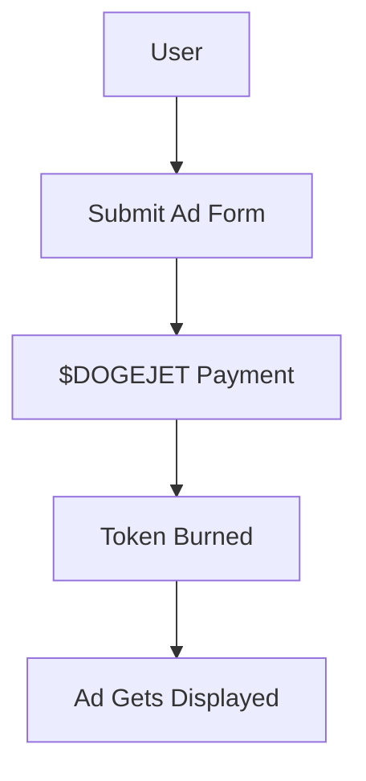

# 🐶 DOGEJET

**DOGEJET** is a lightweight browser-based mobile web game inspired by the indie hacker philosophy of **Pieter Levels**.  
It offers a fast-paced gameplay loop, mobile-first UX, and integrates token-based advertising with a deflationary Web3 model.

> “Simple. Addictive. Profitable.” – all in your browser.

## 🚀 Features

- ⚙️ **Tech Stack:** Next.js + Supabase
- 📱 **Mobile Optimized:** Instant play, no installation needed
- 💸 **Monetization Ready:** Integrated ad system using $DOGEJET token
- 🔁 **Core Gameplay:** Boost + Rotate + Explore – quick sessions, high retention
- 🌍 **Web-Native:** 100% browser-based, PWA-ready
- 🔐 **Secure Backend:** Supabase for DB, Auth, and File Storage

## 💰 $DOGEJET Tokenomics

> $DOGEJET is a **deflationary token** used exclusively for buying in-game ads.

### Key Highlights

- **Total Supply:** 1,000,000,000 DOGEJET (fixed, no minting)
- **Use Case:** Required to publish ads inside DOGEJET
- **Deflation Mechanism:** 100% of used tokens are burned
- **Supply Decreases as Usage Increases**

### How It Works

| Action        | Result                         |
|---------------|--------------------------------|
| Submit an ad  | Pay with $DOGEJET              |
| After payment | Tokens are instantly burned    |
| Result        | Ad is shown after approval     |

### 🧱 System Overview



## 🧪 Gameplay & Development

### Quick Setup

```bash
npm install
npm run dev
```

Open: (https://dogejet.vercel.app/)

### Core Files

- `app/page.js` – Main gameplay view  
- `app/ad-submit.js` – Ad submission form  
- `lib/supabase.js` – Supabase config  
- `utils/burn.js` – Token burn logic (off-chain)

## 📦 Folder Structure (example)

```
/app
  /page.js         → Game UI
  /ad-submit.js    → Ad Submission Page
  /dashboard.js    → Admin Dashboard
/lib
  /supabase.js     → Supabase Client
/utils
  /burn.js         → Off-chain Token Burn Handler
```

## 🔮 Upcoming Features

- [ ] Global ad dashboard with moderation tools  
- [ ] On-chain burn verification via smart contracts  
- [ ] Progressive Web App (PWA) support  
- [ ] Custom user skins & voting system  
- [ ] Global leaderboard  
- [ ] In-game banner ad positioning  

## 🌐 Play Now

👉 **[Live Demo [(https://dogejet.vercel.app/))**  
*(Replace with your actual domain)*

## 🧠 Tech Stack

- **Frontend:** Next.js (App Router)
- **Backend:** Supabase (PostgreSQL, Auth, Storage)
- **Token Logic:** Off-chain burn architecture
- **Deployment:** Recommended on Vercel

